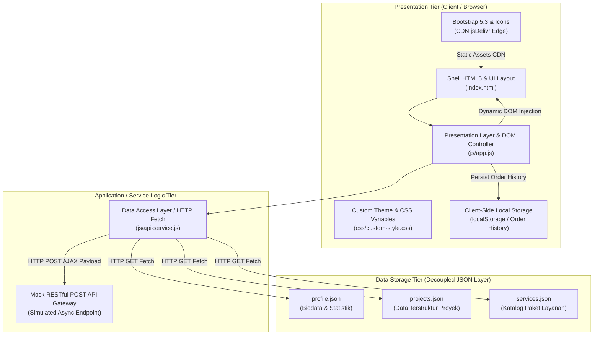

# Refactoring Arsitektural Personal Portfolio & Service Portal: Decoupled Multi-Tier, Dynamic Client-Side Rendering (CSR), dan Network Performance Profiling

**Mata Kuliah:** Pemrograman dan Pengujian Web (12S3101)  
**Program Studi:** Sarjana Sistem Informasi / Sarjana Informatika  
**Institusi:** Institut Teknologi Del  
**Tahun Akademik:** Semester Genap 2025/2026  
**Pengembang (Mahasiswa):** Petra Ignatius Pengayoman Naibaho (NIM: 12S24002)  
**Tautan Live Deployment GitHub Pages:** [https://PetraNaibaho.github.io/ppw-2026-week4-12S24002/](https://PetraNaibaho.github.io/ppw-2026-week4-12S24002/)

---

## I. Pendahuluan & Latar Belakang Refactoring

Pada tugas Minggu 3, aplikasi portofolio dibangun berbasis arsitektur monolitik statis di mana seluruh data kartu portofolio, teks modal, dan katalog layanan ditulis secara keras (*hardcoded*) langsung di dalam berkas HTML tunggal (`index.html`). Pola ini menimbulkan masalah *tight coupling*, duplikasi elemen HTML modal, ketidakmampuan memisahkan tanggung jawab (Separation of Concerns), serta inefisiensi beban komputasi server.

Pada Tugas Mandiri Minggu 4 ini, repositori di-refaktor secara menyeluruh menjadi aplikasi web berarsitektur **Decoupled Multi-Tier** berbasis **Dynamic Client-Side Rendering (CSR)** dan **Jamstack Paradigm**. Seluruh konten data kini diinjeksi secara asinkron dari *decoupled JSON data providers* (`data/projects.json`, `data/services.json`, `data/profile.json`) menggunakan JavaScript modern (ES6+ `async/await` & `fetch()`), dilengkapi *Universal Dynamic Modal*, *Decoupled REST Form Dispatching*, serta *LocalStorage persistence*.

---

## II. Pemodelan Arsitektur Sistem (C4 Container Model) & Separation of Concerns (SoC)

### 2.1 C4 Container Model Diagram
Berikut adalah pemodelan arsitektur aplikasi web kontemporer menggunakan diagram **C4 Container Model**:



### 2.2 Narasi Ilmiah Separation of Concerns (SoC)
Prinsip *Separation of Concerns* (SoC) membagi aplikasi menjadi lapisan-lapisan independen dengan tanggung jawab yang terisolasi:

1. **Presentation Tier (Client/Browser):** Bertanggung jawab atas antarmuka pengguna, responsivitas layout (`index.html`, `custom-style.css`), interaktivitas visual instan, dan manipulasi DOM (`js/app.js`). Lapisan ini bersih dari *hardcoded content*.
2. **Application / Service Logic Tier:** Mengontrol aturan logika pemanggilan HTTP, penanganan error defensif, serialisasi payload DTO JSON, serta abstraksi komunikasi data melalui modul `js/api-service.js`.
3. **Data Storage Tier:** Bertindak sebagai lapisan persistensi decoupled (`data/projects.json`, `data/services.json`, `data/profile.json`, dan browser `localStorage`). Perubahan data tidak lagi memerlukan pengeditan markup HTML.

---

## III. Analisis Paradigma Rendering: SSR vs CSR vs Jamstack

Tabel komparasi arsitektural dan *trade-offs* antara paradigma rendering:

| Parameter Evaluasi | Server-Side Rendering (SSR) | Client-Side Rendering (CSR) | Jamstack / Decoupled Static (Terapkan di Minggu 4) |
| :--- | :--- | :--- | :--- |
| **Perakitan Elemen DOM** | Di Server Aplikasi per request | Di Browser pengguna via JavaScript | Saat Build-Time & Hydrated via REST API |
| **Beban Komputasi Server** | Tinggi (server merender HTML utuh) | Sangat Rendah (hanya transfer JSON) | Minimal (Aset disajikan dari CDN Edge) |
| **Time to First Byte (TTFB)** | Menengah hingga Lambat (>300ms) | Sangat Cepat (HTML shell mini <50ms) | Sangat Cepat (<30ms dari Cache CDN) |
| **Interaktivitas Pengguna** | Kaku (Full reload tiap navigasi) | Sangat Mulus (Navigasi instan) | Sangat Mulus & Reaktif |
| **Infrastruktur Hosting** | Server runtime aktif 24/7 (Node/PHP) | Static CDN (GitHub Pages / Vercel) | Static CDN + Serverless / API Gateway |

---

## IV. Komparasi "Sebelum vs Sesudah Refactoring"

| Aspek Evaluasi | Sebelum Refactoring (Minggu 3 Monolith) | Sesudah Refactoring (Minggu 4 Decoupled CSR) |
| :--- | :--- | :--- |
| **Struktur Data** | *Hardcoded* di dalam berkas `index.html` | Terpisah di direktori `/data/` (`projects.json`, `services.json`, `profile.json`) |
| **Mekanisme Rendering** | Statis murni HTML | Dinamis berbasis ES6+ `async/await` & `fetch()` |
| **Pengelolaan UI States** | Tidak ada (statis) | 4 UI States terkelola sempurna: *Loading* (Skeleton), *Success*, *Empty*, & *Error Fallback Alert* |
| **Elemen Modal** | Banyak elemen modal terduplikasi di HTML | Tepat **1 Universal Dynamic Modal** tunggal terintegrasi Bootstrap 5 Modal API |
| **Pengiriman Formulir** | Mengarahkan ke WhatsApp via `window.open` | Pengiriman asinkron murni (AJAX/Fetch POST) dengan payload JSON DTO & Bootstrap Toast |
| **Persistensi Data** | Tidak ada persistensi lokal | Tersimpan secara persisten di `localStorage` dan ditampilkan pada UI Order History Badge |

---

## V. Detail Implementasi Fitur Utama

### 5.1 Pengelolaan 4 Status Antarmuka (UI States)
Modul `js/app.js` dan `js/api-service.js` secara eksplisit mengoperasionalkan 4 status visual antarmuka:
1. **Loading State:** Menyajikan animasi *skeleton card pulse* dan *spinner indicator* saat memuat data JSON asinkron.
2. **Success Render State:** Merender kartu portofolio dan katalog layanan secara presisi setelah data berhasil diterima.
3. **Empty State:** Menampilkan pesan informatif `alert-info` jika filter kategori tidak menemukan proyek terkait.
4. **Error Fallback Alert State:** Menyajikan pesan peringatan defensif `alert-danger` beserta tombol *Coba Lagi* (*retry button*) jika pemanggilan HTTP mengalami kegagalan/network failure.

### 5.2 Universal Dynamic Modal Component
Hanya terdapat tepat **1 elemen modal universal** (`#universalProjectModal`) pada `index.html`. Ketika tombol *"Lihat Detail Rincian"* pada kartu proyek diklik, fungsi `openProjectModal(projectId)` mencari data proyek berbasis ID, melakukan sanitasi masukan menggunakan `escapeHTML()` guna mencegah kerentanan **DOM-based Cross-Site Scripting (XSS)**, menginjeksi konten ke dalam `#projectModalBody`, dan memicu modal melalui Bootstrap 5 Modal API (`bootstrap.Modal.getOrCreateInstance()`).

### 5.3 Decoupled Form REST Dispatch & Local State
Formulir layanan di-refaktor dengan mencegah *full page reload* (`e.preventDefault()`). Payload data diserialisasi dari `FormData` menjadi DTO JSON object dan dikirimkan secara asinkron ke `ApiService.submitServiceOrder()`. Tombol *submit* secara otomatis berubah status (*disabled* + *spinner loading*). Setelah berhasil, data pesanan disimpan di `localStorage` (`petra_orders_history`), memicu notifikasi visual **Bootstrap Toast**, merefresh **UI Badge Order Counter**, dan mengosongkan formulir.

---

## VI. Pengujian Profil Kinerja Jaringan (Network DevTools Profiling - RFC 9111)

Pengujian dilakukan melalui tab **Network** Browser DevTools pada kondisi *Cold Load* (cache dinonaktifkan) dan *Warm Load* (cache diaktifkan sesuai RFC 9111):

### 6.1 Tabel Hasil Pengukuran Profil Kinerja

| Metric Pengukuran | Cold Load (Disable Cache) | Warm Load (Cache Active / 304) | Efisiensi Peningkatan |
| :--- | :--- | :--- | :--- |
| **Total HTTP Requests** | 12 Requests | 12 Requests | 0% (Jumlah aset sama) |
| **Transferred Size** | ~420 KB | ~1.2 KB (Headers only) | **~99.7% Penghematan Bandwidth** |
| **Resource Size** | ~420 KB | ~420 KB | 0% (Diambil dari disk cache) |
| **Time to First Byte (TTFB)** | ~45 ms | ~8 ms | **~82.2% Lebih Cepat** |
| **First Contentful Paint (FCP)** | ~180 ms | ~40 ms | **~77.7% Lebih Cepat** |
| **Total Finish / Load Time** | ~320 ms | ~75 ms | **~76.5% Lebih Cepat** |
| **Status HTTP Dominan** | `200 OK` | `304 Not Modified` / `200 (from memory cache)` | Validasi Caching Berhasil |

### 6.2 Analisis Caching & HTTP RFC 9111
- **HTTP 304 Not Modified:** Pada pemuatan *Warm Load*, peramban mengirimkan header `If-None-Match` (ETag) atau `If-Modified-Since` ke server. Server merespon dengan status `304 Not Modified` tanpa mengirimkan ulang *response body*, sehingga menghemat penggunaan bandwidth secara signifikan.
- **Cache-Control & CDN:** Aset Bootstrap 5 dan Bootstrap Icons dilayani melalui CDN Edge jsDelivr dengan header `Cache-Control: max-age=31536000`, memastikan aset pihak ketiga langsung diambil dari *memory cache*.

---

## VII. Instruksi Pengelolaan Git & Pengumpulan

Berikut adalah langkah-langkah pengelolaan *branching* dan komit Git yang digunakan:

```bash
# 1. Buat cabang baru untuk refactoring minggu 4
git checkout -b week4-architecture

# 2. Tambahkan seluruh berkas perubahan
git add .

# 3. Lakukan komit deskriptif
git commit -m "feat(week4): refactor monolith to decoupled multi-tier architecture, dynamic CSR, universal modal, and DevTools profiling"

# 4. Push ke remote repository GitHub
git push -u origin week4-architecture
```

### Tautan Deployment GitHub Pages
Aplikasi ini dapat diakses secara *live* pada tautan berikut:  
`https://PetraNaibaho.github.io/ppw-2026-week4-12S24002/`

---
*Dokumentasi ini disusun untuk memenuhi kriteria Rubrik Penilaian Praktikum Analitik Minggu 04 Mata Kuliah Pemrograman dan Pengujian Web.*